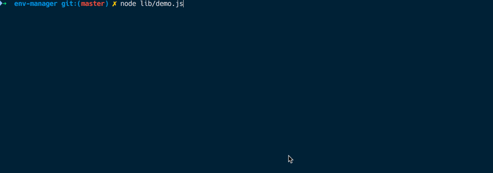

# dotenv-manager
Contactually's environmental variable management CLI. It updates your local `.env` as well as runs the commands for your staging and production values.




### Instantiation
`envManager.js`
```javascript
import envManager from 'env-manager'

envManager({
  stagingCommand: (key, value) => `heroku config:set ${key}=${value} test`,
  productionCommand: (key, value) => `heroku config:set ${key}=${value} prod`
})
```
`package.json`
```javascript

  "scripts": {
    "env:set": "node ./envManager",
  },
```

now running `yarn env:set` will result in the following prompt

### Configuration

  * **envFilePath**: `String` *Optional* this is the path to your local .env file. The default is "./.env"
  * **stagingCommand**: `Function` a function which accepts a key and value, and returns the staging update command. This will be logged and executed in the terminal
  * **productionCommand**: `Function` a function which accepts a key and value, and returns the production update command. This will be logged and executed in the terminal
